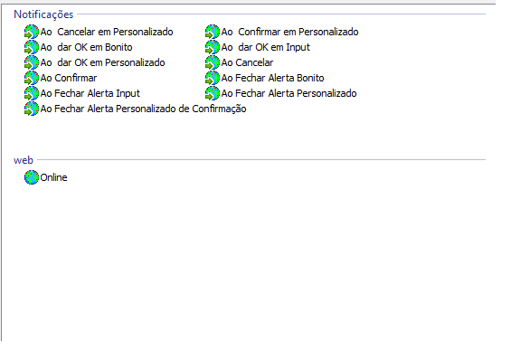
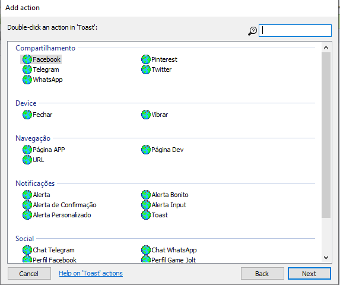
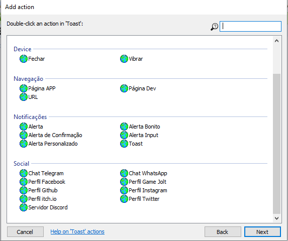
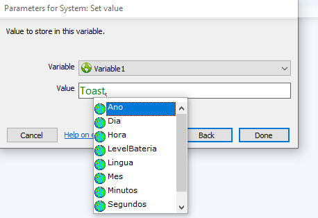

# Plugin Toast

## **Descrição**:
O plugin, faz aparecer Toasts, Alertas e pode-se usar para navegação de páginas, atráves de da própria WEB ou pelos APPs nativos do usuário.

Caso prefira ler a [Documentação do Plugin](docs.md).

## Plugin:

**Condições do Plugin:**

**Ações do Plugin:**

**Expressões do Plugin:**

## **Biblioteca**:

[Repositório Cute Alert](https://github.com/gustavosmanc/cute-alert)

