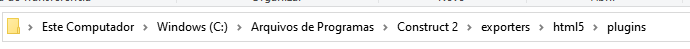
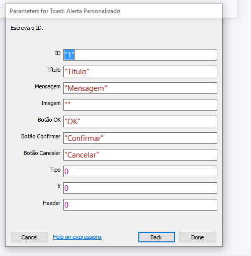

<h1 align="center"><strong>Documentação do Plugin</strong></h1>

<h2 align="center"><strong>Sumário</strong></h2>

<ol>
    <li><a href="#instalar">Como Instalar</a></li>
    <li><a href="#act">Ações</a></li>
</ol>

<h3 align="center" id="instalar"><strong>Como instalar</strong></h3>

Para instalar o plugin, você deve pegar e baixar o plugin aqui no repositório, [clicando aqui](Dutra_Toast).

Após isso, deve por na pasta de onde você instalou o construct 2, abra a pasta exporters/html5/plugins. Jogue a pasta do plugin lá dentro.

Assim que fizer isso, o plugin já estará disponível para o uso no construct 2.

<h3 align="center" id="act"><strong>Ações</strong></h3>

As ações são o que o usuário terá após cumprir certos/condições.

No alerta Personalizado, que será quase a mesma estrutura para todos os alertas, exceto o alerta normal. Esse é do do próprio sistema/navegador.

- `ID` : É responsável em ter um controle, caso deseje que certo Alerta tenha feedback diferente.

- `Título` : É o título que irá aparecer no alerta.

- `Mensagem` : É a mensagem que irá aparecer no alerta.

- `Imagem` : É a Imagem que irá aparecer no alerta. Sendo ela dentro do próprio construct. 
*Exemplo: "nomedaimagem.extensaodaimagem"*

- `Botão OK` : É o texto que irá aparecer dentro do botão OK.

- `Botão Confirmar` : É o texto que irá aparecer dentro do botão Confirmar.

- `Botão Cancelar` : É o texto que irá aparecer dentro do botão Cancelar.

* `Tipo` : É o tipo do Alerta, sendo possível ser: *Sucesso, Erro, Info, Aviso, Confirmação e Input*. (Tendo em mente que Confirmação e Input existe seus específicos.)

- `X` : É o Estilo do X no Header. Sendo possível: *Normal, Circular e Vázio.*

- `Header` : O Header é a parte de cima do Alerta, sendo possível ter 3 opções do Header: *Com o Fundo, Sem o Fundo e Sem o Header*. (Tendo em mente que, se escolher o **Sem o Header**, o Alerta irá ficar sem imagem e o X.)